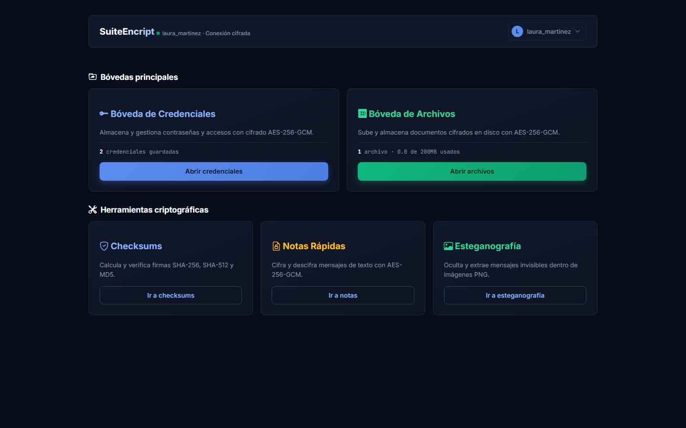
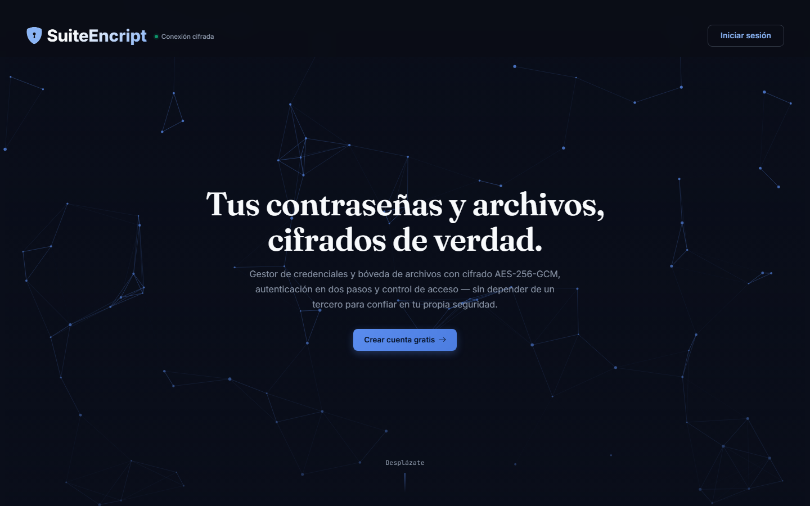
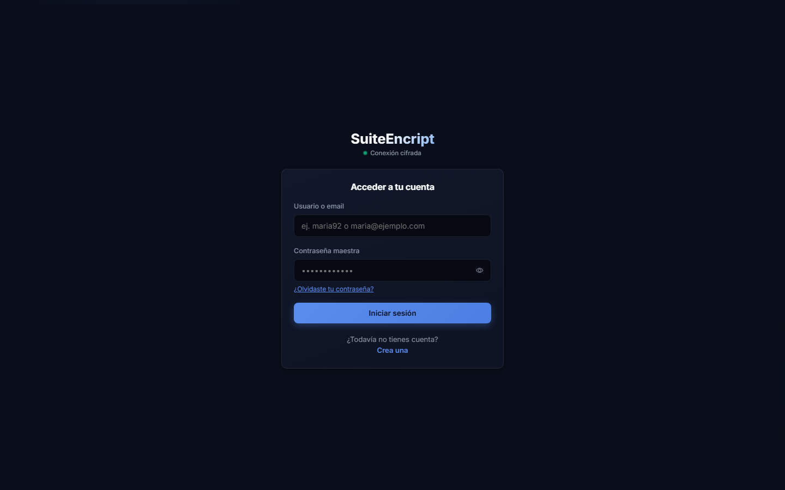
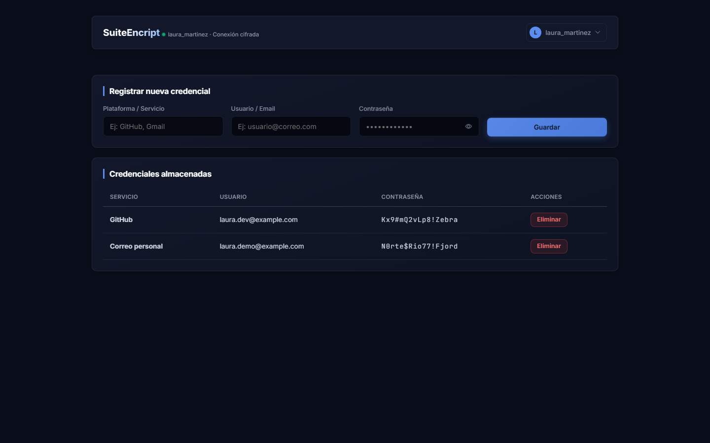
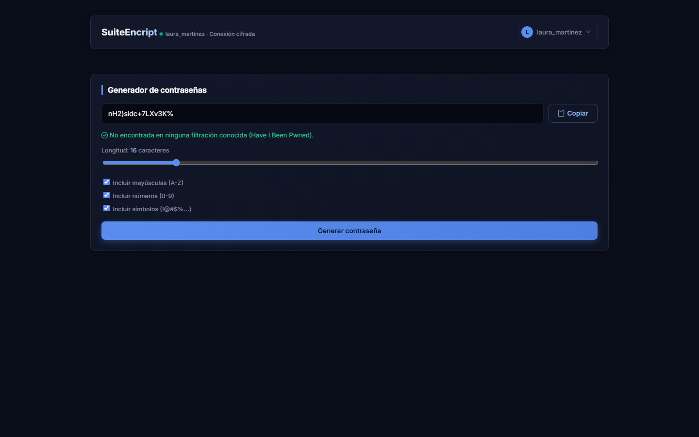
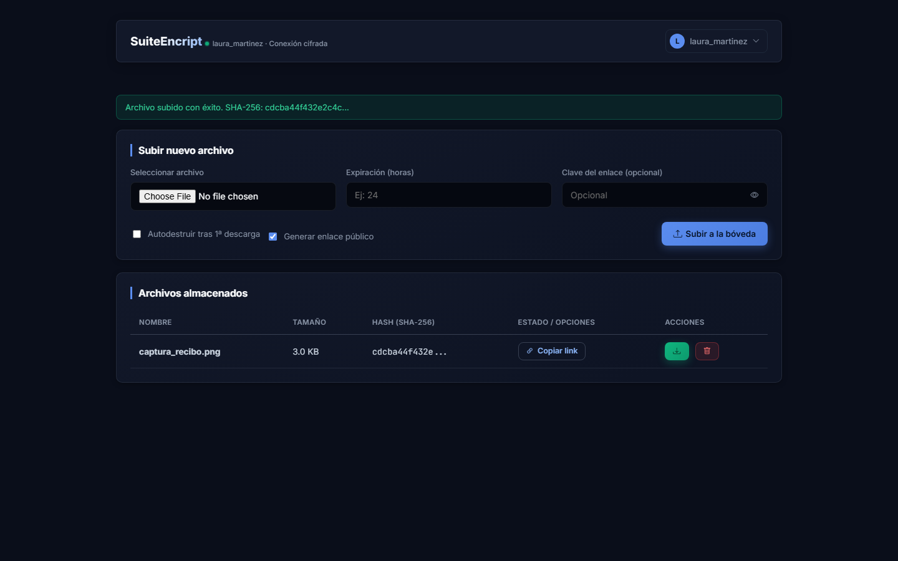
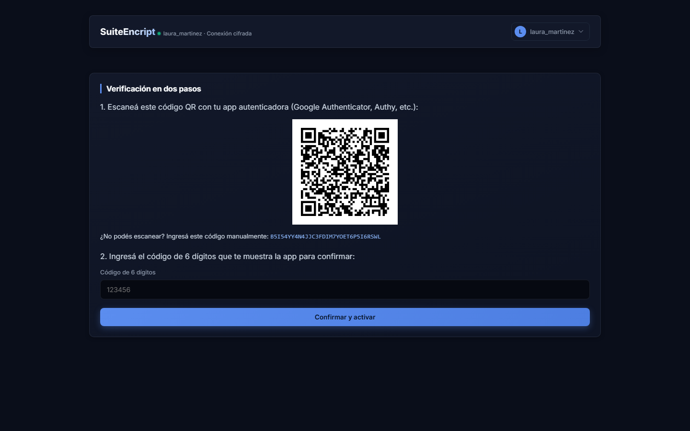
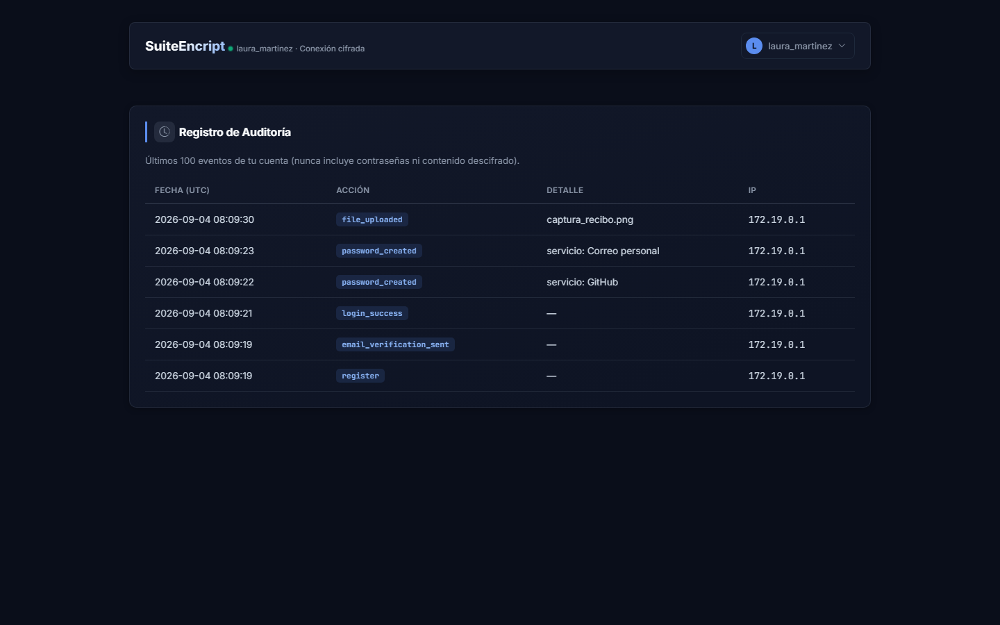

# SuiteEncript

Gestor de contraseñas y bóveda de archivos cifrados. Lo empecé como un
script de escritorio con SQLite para practicar cifrado y terminó siendo
una aplicación con base de datos administrada, autenticación en dos
pasos, escaneo de malware en las subidas, CI/CD y un despliegue real —
no una maqueta, algo que corre en `suiteencript.onrender.com` ahora
mismo.



## Qué hace

Guarda contraseñas y archivos cifrados con AES-256-GCM, punto — nunca
texto plano en la base de datos, ni siquiera para "solo mostrar". A
partir de ahí:

- El generador de contraseñas avisa si lo que acaba de generar ya
  apareció en alguna filtración conocida, consultando Have I Been Pwned
  sin mandarle la contraseña real (solo un fragmento de su hash).
- Los archivos de la bóveda se pueden compartir por enlace, con
  contraseña opcional, fecha de expiración o auto-destrucción después de
  la primera descarga.
- 2FA opcional por cuenta (TOTP, cualquier app tipo Google Authenticator),
  con códigos de respaldo por si perdés el teléfono.
- Recuperación de contraseña por email y verificación de la casilla.
- Antes de guardar un archivo subido, se escanea con un set de reglas
  YARA propio (PDFs con JavaScript embebido, macros de Office
  autoejecutables, webshells) — la validación de tipo de archivo por sí
  sola no detecta eso.
- Herramientas sueltas: checksums (MD5/SHA-1/SHA-256/SHA-512), cifrado
  rápido de texto, esteganografía.
- Cada cuenta tiene su propio registro de auditoría — login, cambios de
  2FA, qué se subió o borró — nunca contraseñas ni contenido descifrado.

## Capturas

| | |
|---|---|
|  Página pública |  Inicio de sesión |
|  Gestor de contraseñas |  Generador + verificación HIBP |
|  Bóveda de archivos |  Activación de 2FA |
|  Registro de auditoría | |

## Cómo está armado

```
Navegador
   │  HTTPS
   ▼
Render (Docker: gunicorn + Flask)
   │
   ├── app/routes/   rutas por área (auth, contraseñas, bóveda, herramientas)
   │                 cada una revisa la sesión y filtra todo por el usuario dueño
   │
   └── app/utils/    lo reutilizable: cifrado, TOTP, HIBP, storage, email, etc.
   │
   ├──► Neon (Postgres) — usuarios, contraseñas cifradas, metadata, auditoría
   └──► Supabase Storage — archivos cifrados de la bóveda (el disco del
        contenedor es efímero, se borraría en cada redeploy)
```

Neon en vez del Postgres gratuito de Render porque el de Render expira a
los 90 días. Supabase Storage en vez de Cloudflare R2 porque R2 pide
tarjeta de crédito antes de darte acceso a la API, incluso en el plan
gratuito. El razonamiento completo de cada decisión está en
`ARCHITECTURE.md`.

## Seguridad

Un solo esquema de cifrado en todo el proyecto (AES-256-GCM), contraseñas
de cuenta con hash irreversible, control de acceso verificado por sesión
en cada consulta (nunca solo por el id del registro), rate-limiting en
los endpoints donde importa. El detalle completo, incluido el repaso
categoría por categoría contra el OWASP Top 10, está en `SECURITY.md`.

## Stack

| Capa | Elección |
|---|---|
| Backend | Python 3.13, Flask |
| Base de datos | PostgreSQL en Neon, vía SQLAlchemy + Flask-Migrate |
| Cifrado | AES-256-GCM (`cryptography`), contraseñas hasheadas con Werkzeug |
| 2FA | `pyotp` + `qrcode` |
| Archivos de la bóveda | Supabase Storage (S3-compatible vía `boto3`), con fallback a disco local en dev |
| Email | API HTTP de Brevo |
| Frontend | Jinja2 (plantillas del lado del servidor), sin framework de JS |
| Contenedores | Docker + Docker Compose |
| CI | GitHub Actions: lint, tests, `bandit`, `pip-audit`, build de Docker |

## Correrlo en tu máquina

```bash
git clone https://github.com/edu994/SuiteEncript.git
cd SuiteEncript
python -m venv .venv
.venv/Scripts/pip install -r requirements-dev.txt

cp .env.example .env

# con Docker (levanta Postgres + Redis de una):
docker compose up -d
FLASK_APP=main.py .venv/Scripts/flask db upgrade

.venv/Scripts/python main.py   # http://localhost:5000
```

Sin Docker también funciona: si no ponés `SQLALCHEMY_DATABASE_URI` en el
`.env` usa SQLite local, y si no ponés `VAULT_MASTER_KEY` se genera un
archivo de clave solo para desarrollo. Nada que configurar a mano para
probarlo.

```bash
.venv/Scripts/python -m pytest          # tests
.venv/Scripts/ruff check .              # lint
.venv/Scripts/bandit -r app main.py -ll # seguridad
```

## Desplegarlo

`DEPLOY.md` tiene la guía paso a paso completa (Supabase, Neon, Render, y
qué variables de entorno cargar en cada una).

## Sobre el proceso

Trabajé bastante de la implementación con Claude Code como parte normal
del flujo — lo uso para iterar rápido y sacarme de encima el código de
relleno, no para que decida por mí. Las decisiones de arquitectura, qué
seguridad importaba priorizar y por qué, y la revisión de cada cambio
antes de mergearlo son mías; documentadas con la razón detrás de cada
una en `ARCHITECTURE.md`, no solo el "qué" sino el "por qué esto y no lo
otro". Hubo incidentes reales en el camino — el más serio, una suite de
tests mal aislada que llegó a borrar tablas de la base de datos de
producción — y quedaron documentados con causa raíz y corrección en
`CHANGELOG.md`, no escondidos.

## Otros documentos

- `ARCHITECTURE.md` — por qué el proyecto está armado como está, decisión
  por decisión.
- `CHANGELOG.md` — historial de cambios, incluidos los incidentes reales
  y cómo se resolvieron.
- `SECURITY.md` — postura de seguridad y el repaso contra OWASP Top 10.
- `DEPLOY.md` — guía de despliegue.
- `DEMO.md` — guion para presentar el proyecto en vivo.
